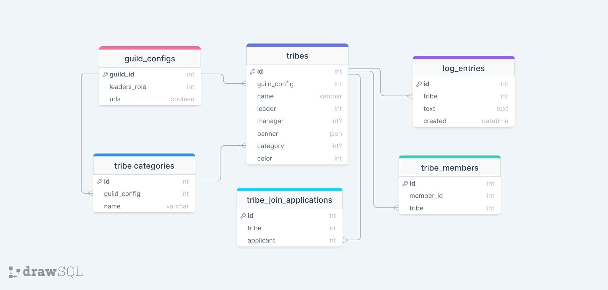

# TribalBot-rewrite

Collaborative project to rebuild Tribal Bot a new.
All hands accepted

## Project structure

```
tribalbot/
    src/               # the project's logic
        bot/           # all the bot's components and setup logic
            cogs/      # all bot's cogs (extensions)
        orm/           # all database logic and interactions
            models.py  # each model represents a table. 
                       # each model should be a single file but imported 
                       # on the folder's __init__.py
        controllers/   # Contains code that communicates the database with the commands
        utils/         # contains helper code
    main.py            # does final preparations and launches the bot
```

## Table Schema


## Code Style

The project uses a mixture of OOP and functional programing.
The database and it's models should be fully OOP
The bot's cogs are classes but commands should be designed following a functional approach.

## command style

Ideally all the output of the bot should come in the form of embeds except for short ephemeral messages
Embed colors should be saturated greens and oranges
The terminology of the bot and its commands should reflect a tribal style

## Development notes:

The environmental file must be named `.env`. 

The program is Database "agnostic" meaning it will work with either SQLite, PostgreSQL or MySQL. All you have to do is set up the database url in the `.env` file.

## Philosophy and cultural remarks

### Tribe Definition

**Tribe**: A social division in a traditional society consisting of families or communities linked by social, economic, religious, or blood ties, with a common culture and dialect, typically having a recognized leader.

Tribes depicted throuout this bot does not belong to any particular culture around the world. Any and all similarities with real world cultures are marely accidental and coincidental. 

## Contributions

Please submit PRs to contribute as well as rising any issues you deem important. 

## Disclosure of Responsibility

**TRIBAL BOT** IS PROVIDED "AS IS", WITHOUT WARRANTY OF ANY KIND, EXPRESS OR IMPLIED. IN NO EVENT SHALL THE AUTHORS BE LIABLE FOR ANY CLAIM, DAMAGES OR OTHER LIABILITY, ARISING FROM, OUT OF OR IN CONNECTION WITH THE USE OF THIS BOT.
